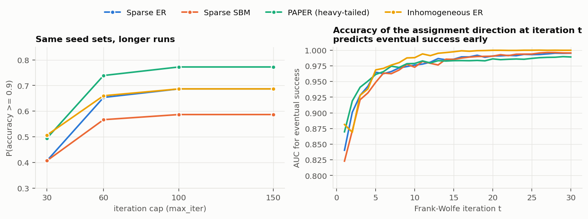
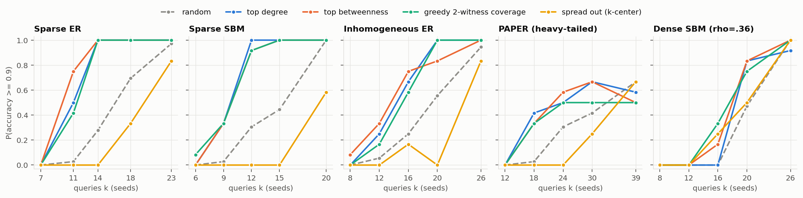
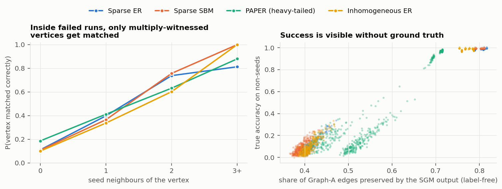

# Which correspondences should we pay for? Seed-query experiments for SGM

*Exploratory report (Claude, 23 Sep 2026). All numbers come from the scripts and CSVs in this folder. Sample sizes are small (6–12 graph pairs per cell), so treat differences under ~0.1 in success probability as unresolved.*

**Question.** Given Graph A, a budget of *k* queries (a query reveals the true Graph-B partner of one Graph-A vertex), and possibly some already verified matches, can we choose seeds that make SGM more accurate than standard choices at the same budget?

## TL;DR

1. **Choosing seeds beats random by a wide margin, and the standard choice (top degree) was as good as anything else I tried.** In the four sparse regimes, top-degree seeds reached 50% success with about 25–30% fewer queries than random seeds. Examples: 11 vs 16 queries on sparse ER, and 22 vs 30 on PAPER. On 48 fresh pairs at the most discriminating budget, none of five alternative static rules beat top degree reliably. The rules were betweenness, 3-hop reach, two greedy witness-coverage rules and community-stratified degree. The pooled differences in success probability ranged from −0.01 to +0.07, and every 95% CI includes 0. Screening random sets by a feature score was worse than top degree.
2. **Spreading seeds apart hurts on sparse synthetic graphs.** A k-center rule over the graph core was worse than random in all four sparse regimes (−0.10 to −0.24 in success probability; PAPER's CI touches 0).
3. **Why degree works: a "witness/ignition" mechanism.** Inside failed runs, a non-seed vertex is matched correctly with probability ≈0.1–0.2 if it has no seed neighbour, ≈0.35–0.4 with one, ≈0.6–0.75 with two, and ≥0.8 with three or more. My reading: a run succeeds when enough multiply-witnessed vertices appear to start a cascade, and high-degree seeds maximize seed–non-seed incidences. The accuracy of the assignment direction at iteration 3–5 predicts eventual success with AUC 0.92–0.97 (iteration 1, i.e. H0: 0.82–0.88).
4. **Solver settings change what looks like "seed quality".** With graspologic's default `max_iter=30`, 18–28% of runs counted as failures succeed if allowed to run longer, and none go the other way. At the tipping point, keeping the best-objective run out of 2–4 restarts already succeeded for all three of the repo's one-seed baseline seed sets, with no extra query. Near the transition, compute (iterations, restarts) substitutes for paid queries. Seed choice matters most below the transition.
5. **Success is visible without ground truth.** The share of Graph-A edges preserved by the SGM output separated successes from failures perfectly within each regime (AUC 1.00; the cut-off depends on the regime). This supports sequential budgets: buy top-degree seeds in batches and stop when that signal jumps. If the signal is thresholded correctly, this averaged ~8–20% fewer queries on the coarse E1 grid than a fixed budget sized for 90% success.
6. **Adaptivity did not reliably help.** With 40% of the budget already verified at random, the best adaptive rule was to query high 3-hop-reach vertices whose SGM match still changes across restarts. In E2 it reached 0.74 success vs 0.62 for top degree. The replication on 16 new pairs (E2b) gave only 0.66 vs 0.63, and the combined estimate is +0.07 (95% CI [0.00, +0.15], 56 configurations). A static control that only discounts vertices already pinned down by the verified seeds matched top degree. Starting from nothing, no adaptive rule beat top degree (0.96). For choosing the *next single* seed, uncertainty signals and first-gradient features carried no useful information, and structure (3-hop reach, degree) was the only signal.
7. **Real graphs behave differently (Enron, n = 129–174).** In the easy real pairs, 2–4 random seeds already give about 0.65–0.8 accuracy. There, top-degree seeds were not consistently better than random and were worse at most budgets. Spread-out seeds and resolving structural twins sometimes helped slightly, mostly within noise. This matches a two-phase picture: first get the cascade started (central seeds), then pay for the vertices structure cannot disambiguate (peripheral vertices and twins).

---

## 1. Setup

* **Solver.** The environment could not install graspologic, because the package index was blocked. `sgmlib.py` therefore re-implements the same FAQ/SGM algorithm: barycenter start, Frank–Wolfe with exact line search, final linear assignment, and graspologic-style random tie-breaking. **Validation:**
  * Line-search terms match `scipy.optimize.quadratic_assignment(method="faq")` to 1e-15. Runs that end differently from scipy differ only in which of several *equally optimal* assignments the LAP picks, i.e. tie-breaking.
  * On 60 sets from the saved PAPER solver audit, my success rate at 30 iterations is 0.49 (graspologic 0.50). My estimates agree with graspologic about as well as graspologic agrees with itself: split-half r = 0.63 vs 0.58.
* **Regimes.** These are the repo presets. Sparse ER (n=600, p=.01, ρ=.8), sparse SBM (3×200, ρ=.8), IER (Beta(1,99) edge probabilities, ρ=.77), PAPER (Chung–Lu + ER, heavy-tailed, ρ=.7), and dense SBM (3×100, p_in=.3, p_out=.1, ρ=.36; the cross-pair "sbm" regime).
* **Protocol.**
  * Success means ≥90% accuracy on non-seeds.
  * The main runs use `max_iter=100`, and I also record the iteration-30 state for comparability with the existing results.
  * Every seed set gets 2–5 tie-breaking restarts.
  * Rules are compared on the same fresh pairs with common restart seeds.

## 2. Measurement comes first (E0: saved fixed pairs, 3 restarts, up to 150 iterations)

| | sparse ER | sparse SBM | PAPER | IER |
|---|---|---|---|---|
| P(success) @30 → @100 iterations | .41 → .69 | .41 → .59 | .49 → .77 | .51 → .69 |
| runs failing @30 but succeeding by 150 | 28% | 18% | 28% | 18% |
| seed sets with mixed outcomes over 3 restarts (converged) | 44% | 36% | 27% | 38% |

The repo's existing labels (single run, 30 iterations) therefore mix three things: seed quality, convergence speed, and solver luck. Everything below uses restarts and 100 iterations.

## 3. Static rules at equal budget (E1: 6 fresh pairs × 5 budgets per regime; E1b: 12 more pairs at one budget)

Median budget (queries) needed for 50% success, over 6 pairs (linear interpolation on the budget grid):

| regime | random | top degree | top betweenness | 3-hop reach | greedy 2-witness | spread out |
|---|---|---|---|---|---|---|
| sparse ER | 15.8 | 11.0 | 9.0 | 12.5 | 11.0 | 19.2 |
| sparse SBM | 14.2 | 9.8 | 9.8 | 9.8 | 9.0 | 20.0 |
| IER | 19.0 | 14.0 | 14.0 | 13.0 | 15.0 | 23.0 |
| PAPER* | 29.8 | 22.5 | 21.0 | 19.5 | not reached | 32.2 |
| dense SBM | 20.8 | 18.0 | 18.0 | 18.0 | 17.0 | 17.0 |

\*PAPER accuracy saturates near 0.75, largely because isolated and degree-1 vertices are rarely matched (E0). As a result, 30% of PAPER pairs never reach 50% success within the grid.

* **The gap to random is robust; the differences among the good rules are not.** On the E1b focused test (12 new pairs per regime, at the budget where top degree succeeds about half the time), the pooled differences vs top degree were:

  | rule | Δ success vs top degree | 95% CI |
  |---|---|---|
  | betweenness | +0.02 | [−0.07, +0.12] |
  | 3-hop reach | −0.01 | [−0.14, +0.10] |
  | greedy 2-witness coverage | +0.07 | [−0.02, +0.18] |
  | greedy 3-within-2-hops coverage | +0.01 | [−0.09, +0.10] |
  | community-stratified degree | −0.01 | [−0.15, +0.11] |
  | random | −0.44 | [−0.55, −0.33] |

  Greedy 2-witness coverage had the best point estimate in E1b. It was not better in E1, so this is not a finding yet.
* **Screening random sets by a feature score** (the "best of 50 random sets by 3-hop score" idea from the earlier notebook analysis) beats random, but trails top degree by 0.05–0.25. Random pools rarely contain sets as good as a constructed high-degree set.
* **The "SGM wants spread-out, bridging seeds" hypothesis is not supported on sparse synthetic graphs.** The spread-out rule is the worst rule tested. Among all constructed and random sets, *compactness* and witness overlap (vertices with ≥2 seed neighbours) add a little beyond mean seed degree (partial ρ ≈ 0.1–0.3).
* **Dense SBM (ρ = .36):** gains over random are small (at most about 0.12). There, seed choice hardly matters.

## 4. Why top degree is hard to beat: witnesses and ignition

* **Left panel (E0, per vertex).** Inside failed runs, a vertex is matched correctly mostly when it has two or more seed neighbours. After a success nearly everything is matched. The remaining errors are concentrated on degree ≤1 vertices, which account for 29–50% of residual errors.
* **Reading.** SGM succeeds when the seeds create enough multiply-witnessed vertices that the Frank–Wolfe iterations lock in. That is largely decided within the first ~5 iterations (Fig. 0, right). Top degree maximizes the number of seed–non-seed incidences, which is the raw material for witnesses. Rules built to create witness *overlap* choose sets that overlap 0.4–0.75 (Jaccard) with the top-degree set, and they end up with similar witness counts.
* **Right panel (E1).** The share of preserved edges is a label-free success detector (AUC 1.00 per regime; correlation with true accuracy 0.95–1.00). Practical use: detect ignition, then stop buying "ignition" seeds or switch to clean-up queries.

## 5. Adaptive querying with verified matches (E2: 3 pairs × 4 regimes × 2 draws of S0; E2b: 4 new pairs × 4 regimes × 2 draws)

S0 is 0.4·k_cal random verified matches, plus 0.4·k_cal queries spent in 3 batches. After each batch SGM is re-run with 3 restarts. k_cal is the budget where random sets succeed ~50% at 30 iterations.

E2 results:

| strategy | P(success), with S0 | P(success), no S0 (all 0.8·k_cal queried) |
|---|---|---|
| random | 0.27 | 0.34 |
| top degree | 0.62 | **0.96** |
| 3-hop reach | 0.65 | 0.85 |
| greedy coverage (2 hops, cap 3) | 0.58 | 0.92 |
| adaptive: low local edge consistency × reach | 0.55 | 0.92 |
| **adaptive: restart disagreement × reach** | **0.74** | 0.88 |
| adaptive: coverage of uncertain vertices | 0.62 | 0.92 |

* **The only positive adaptive result did not replicate cleanly.** In E2, restart disagreement × reach gained +0.12 vs top degree with S0 (CI [0.00, +0.26]). All of that gain came from sparse ER (0.88 vs 0.58) and sparse SBM (0.75 vs 0.54); on IER and PAPER it tied top degree. Its picks overlap 0.6–0.8 with the static 3-hop-reach picks (0.33 on PAPER). In practice it is "high-reach vertices, minus those the verified seeds already pin down" (the vertices on which all restarts agree).
* **E2b replication (4 new pairs per regime × 2 S0 draws, same protocol).** P(success) was 0.63 for top degree, 0.57 for 3-hop reach, and 0.66 for disagreement × reach. A static control, reach × (1 − P(correct | number of verified neighbours)) using the E0 witness curve, scored 0.63. The gain vs top degree was +0.03 [−0.06, +0.12], and the regime pattern changed: the gain moved from sparse ER to PAPER. Pooled over E2 and E2b it is +0.07 [0.00, +0.15]. Any real adaptive gain in this setting is small, around +0.1 at most.
* **The value of choosing, in one number.** For the same total budget, 0.4·k random verified + 0.4·k top-degree queries succeeded 0.62 of the time, vs 0.96 for 0.8·k top-degree queries. Random verified matches are worth much less than chosen ones, so a query budget should complement them rather than repeat their coverage.
* **Why the phase-aware rule never switched.** Before the budget ran out, SGM had rarely "ignited" (4% of rounds). The adaptive rules therefore operate almost entirely in the pre-ignition phase, where uncertainty is high everywhere and structure is what matters.

## 6. The next single seed (E3: the repo's one-seed problems, 150 candidates × 5 restarts, baseline × 16)

| | PAPER | sparse ER | sparse SBM |
|---|---|---|---|
| baseline P(success), per run (@100 it.) | 0.50 | 0.44 | 0.31 |
| baseline, best-objective of 4 restarts: accuracy | 0.98 | 1.00 | 1.00 |
| + one random extra seed, per run | 0.62 | 0.62 | 0.39 |
| old single-run labels vs new 5-restart estimate (AUC) | 0.56 | 0.58 | 0.68 |
| share of outcome variance that is between candidates | 0.06 | 0.18 | 0.28 |
| Spearman(3-hop reach of candidate, Δ success) | +0.30 | +0.25 | +0.19 |
| Spearman(first-gradient top-2 gap, Δ success) | +0.08 | −0.09 | −0.08 |
| Spearman(restart agreement at candidate, Δ success) | −0.05 | −0.00 | −0.03 |
| top-10 candidates by 3-hop reach: mean P(success) | 0.90 | 0.74 | 0.40 |

* The old single-run labels were only weakly related to the restart-averaged outcome (AUC 0.56–0.68).
* At the tipping point, a few restarts do the job of the extra query.
* Where a candidate does matter, structure (reach, degree) is the signal. The gradient-margin and uncertainty features are not.

## 7. Real graphs: Enron (E4; 8 random draws × 6 restarts per budget)

Three real pairs:
* **week:** weeks 148/149, n = 129.
* **window:** 4-week unions, n = 131, noisy (only ~60% of edges shared).
* **sub:** an edge-subsampled 60-week parent, n = 174.

Mean non-seed accuracy:

| pair, k | random | top degree | betweenness | spread out | twins-aware* |
|---|---|---|---|---|---|
| week, k=4 | 0.77 | 0.87 | 0.69 | 0.70 | 0.73 |
| week, k=16 | 0.87 | 0.83 | 0.87 | 0.88 | 0.88 |
| sub, k=2 | 0.66 | 0.37 | 0.70 | 0.38 | 0.37 |
| sub, k=12 | 0.83 | 0.80 | 0.80 | 0.89 | 0.80 |
| window, k=24 | 0.40 | 0.36 | 0.34 | 0.47 | 0.34 |

\*Half top degree, half vertices with identical Graph-A neighbourhoods. The twins-only rule reached 0.89–0.90 at k = 12–16 on *week*.

Across random draws the standard deviation is 0.02–0.09, so most gaps here are within noise. The robust point is qualitative. Two of the three real pairs are easy, and after a few seeds the matching is already in its "clean-up" phase. Hubs are then poor queries, and peripheral or ambiguous vertices are better ones. On *window*, no rule rescues a pair that is too noisy.

## 8. What this suggests for the chapter

* **"A rule that beats top degree" looks hard to support** for static structural rules in these regimes. A defensible framing:
  * *When* does the choice matter (sparse graphs, below the transition), and by how much (~25–30% of queries vs random for top degree)?
  * *Why* do high-degree seeds work (witness/ignition)?
  * *How* should a budget be spent over time: detect ignition without labels, then switch from central seeds to clean-up queries on ambiguous or peripheral vertices.
* **Next experiments I would run:**
  1. Settle whether adaptivity helps at all. Test restart disagreement × reach (with verified matches) against top degree and E2b's static control on many more pairs, with random-verified fractions other than 40%.
  2. A two-phase policy (degree until the preserved-edge signal fires, then twins/low-consistency vertices) on real pairs at n ≥ 1,000, e.g. edge-subsampled SNAP graphs.
  3. Re-run the repo's feature/regression analyses with restart-averaged, 100-iteration labels. The current labels mix seed quality with convergence speed and solver luck.
* **Limitations:**
  * The solver is a re-implementation. It is validated, but it is not graspologic.
  * n ≤ 600.
  * Budget grids are coarse, with 2–5 restarts per set.
  * The adaptive rules are simple heuristics.
  * The Enron pairs are small.

## Files

See `README.md`. Raw run-level results are in `results/` (one row per SGM run). The figures are regenerated by `make_figures.py`.
